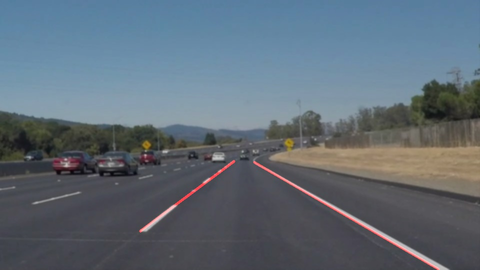

# **Self Driving Car Udacity Assignment 1 (Lane Tracking** 

Input Image:
------------

Output Image:
------------

Flow of the Pipeline:
---------------------
1. Convert Color to Black & White Image
2. Canny edge detector to detect edges
3. Hought transform to find lines
4. Extrapolation of lines using and finding two lines left and right line for the line
