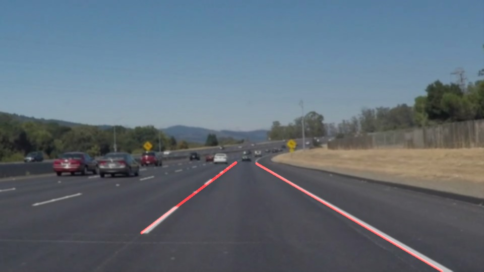

# **Finding Lane Lines on the Road** 

## Writeup Template

**Finding Lane Lines on the Road**

### Reflection

### 1. Describe your pipeline. As part of the description, explain how you modified the draw_lines() function.

My pipeline consisted of 5 steps.
1. Adding Gaussian noise for blur effect, Convert Color to grayscale Image 
2. Canny edge detector to detect edges
3. Selecting some Region of Interest (ROI)
3. Hough transform to find lines from the detected pixels from edge detection
4. Extrapolation of lines using and finding two lines left and right line from the lines found using hough transform

In order to draw a single line on the left and right lanes, I modified the draw_lines() function by
1. 

Flow of the pipeline with the outputs:
If you'd like to include images to show how the pipeline works, here is how to include an image: 
1. Gray output:
2. Edge detection (Canny):
3. Region of Interest:
4. Hough transformlines output:
#### 5. Extrapolation of Lines ouput:

![alt text][./test_images_output/solidWhiteCurve.jpg]

### 2. Identify potential shortcomings with your current pipeline

For the challenge video
1. the region of interest has to be changed becaue of the change in camera postion the front part of the car is also coming into camera view.
2. There are also different lighting conditions like under the shade (less light) and sunlight (more light) causing the noise from the edge detector (as there were fixed threshold limits through out the video)

### 3. Suggest possible improvements to your pipeline
Possible improvement would be to:

Adaptive thresholding of edges depending on the lighting (for overall image)

Another potential improvement could be to:

collect good dataset and use deep learning instead of handtuning the parameters for different conditions
